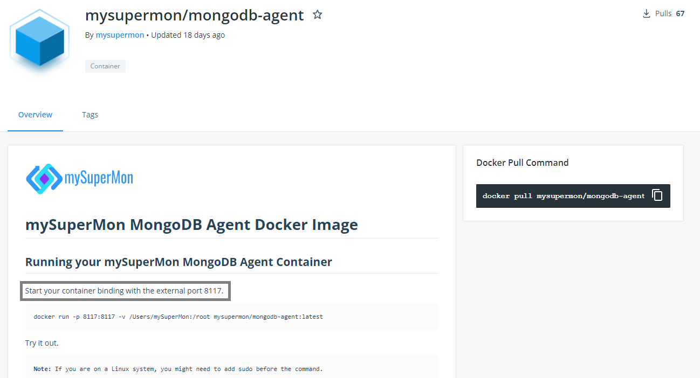

# mySuperMon-service


The *mysupermon-service* is a [Keptn](https://keptn.sh) service that is responsible for collecting datatbase statistics performed while test sequence executed using [mySuperMon](https://app.mysupermon.com) endpoints.

We are going to install the service in the same cluster that Keptn is running in.
Checkout also the [installation option for Keptn on K3s](https://github.com/keptn-sandbox/keptn-on-k3s).

## Installation

### Deploy mySuperMon database Agent

1. Create a agent.yml file and copy below yml content paste into it.  and IMAGE_NAME with image name you need (), you can find myspermon agent images here [mySuperMon Docker hub](https://hub.docker.com/u/mysupermon)

    `NOTE`
            Replace AGENT_DATABASE_NAME with the agent supported database name

            IMAGE_NAME with image name you need (), you can find myspermon agent images here [mySuperMon Docker hub](https://hub.docker.com/u/mysupermon)

            Replace port no with agent supported port you can find it on it's docker hub overview tab.

            

    ```yml
    apiVersion: apps/v1
    kind: Deployment
    metadata:
        name: AGENT_DATABASE_NAME-agent  #Replace AGENT_DATABASE_NAME with the agent supported database name
    spec:
        replicas: 1
        selector:
            matchLabels:
            app: AGENT_DATABASE_NAME-agent  #Replace AGENT_DATABASE_NAME with the agent supported database name
        template:
            metadata:
                labels:
                app: AGENT_DATABASE_NAME-agent  #Replace AGENT_DATABASE_NAME with the agent supported database name
            spec:
                containers:
                - name: AGENT_DATABASE_NAME-agent  #Replace AGENT_DATABASE_NAME with the agent supported database name
                image: mysupermon/IMAGE_NAME:latest  #Replace the IMAGE_NAME with image name you need, you can find myspermon images here https://hub.docker.com/u/mysupermon
                ports:
                - containerPort: 8111  
    ```

### Add application and it's database

1. Visit to [mySuperMon](https://app.mysupermon.com) and log in.

1. Watch this video to add application and it's datasource

[](https://www.youtube.com/watch?v=YOUTUBE_VIDEO_ID_HERE)

### Deploy mySuperMon Service

Now we will deploy the mySuperMon Service in the Keptn Cluster.

1. Create a secret using mySuperMon username and password, you can go ahead and copy/paste this next line. Make sure you are connected to the correct Kubernetes cluster.

    ```
    kubectl create secret generic mysupermon --from-literal="mysupermon_username=YOUR_MYSUPERMON_USERNAME" --from-literal="mysupermon_password=YOUR_MYSUPERMON_PASSWORD" -n keptn
    ```

1. Now clone the muysupermon service repo

    ```
    git clone https://github.com/keptn-sandbox/mySuperMon-service.git
    ```

2. Before applying deployment file add your KEPTN_ENDPOINT url and KEPTN_API_TOKEN to the service.yml 'env section'.

    ```yaml
    ...
    env:
        - name: KEPTN_ENDPOINT
          value: '' #TODO: Add your keptn api endpoint eg: http://1.2.3.4.nip.io/api
        - name: KEPTN_API_TOKEN
          value: '' #TODO: Add your keptn api token
        - name: MYSUPERMON_ENDPOINT
          value: 'https://app.mysupermon.com'
    ...
    ```
3. 
